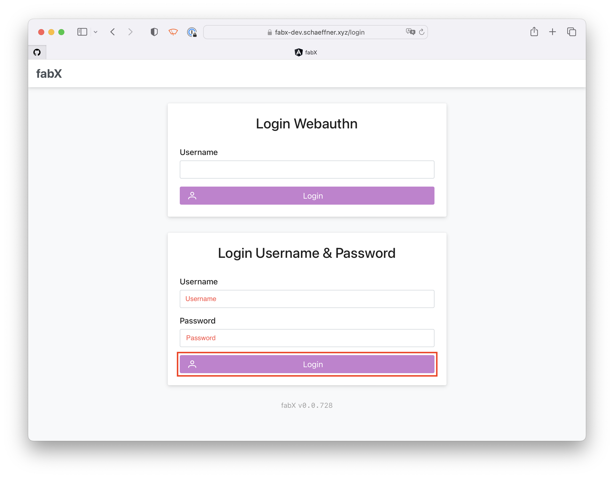
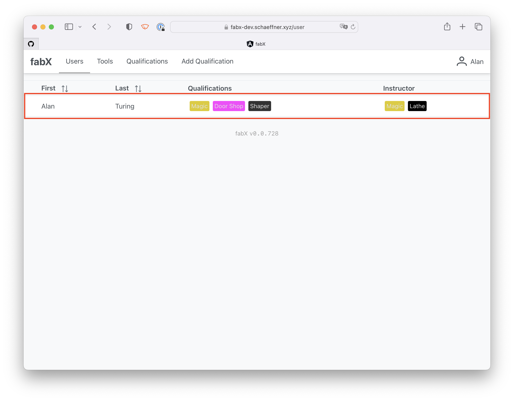
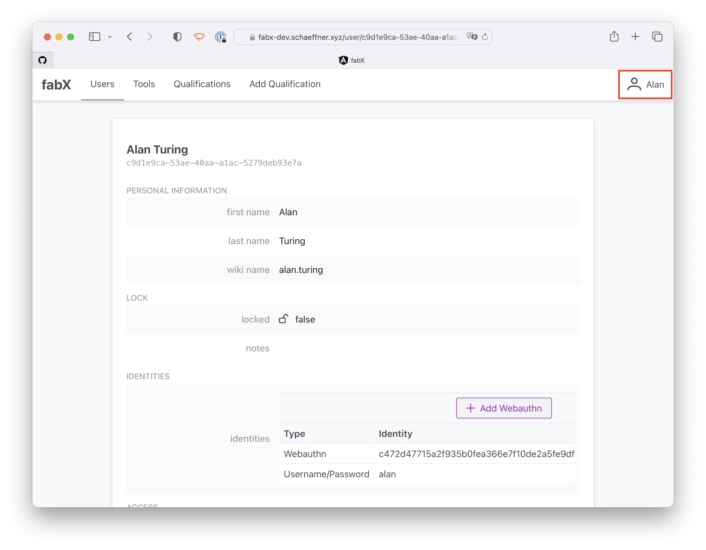
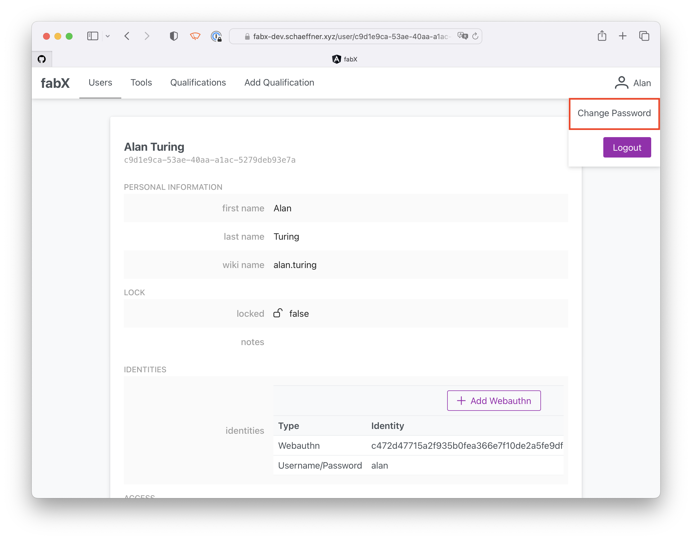
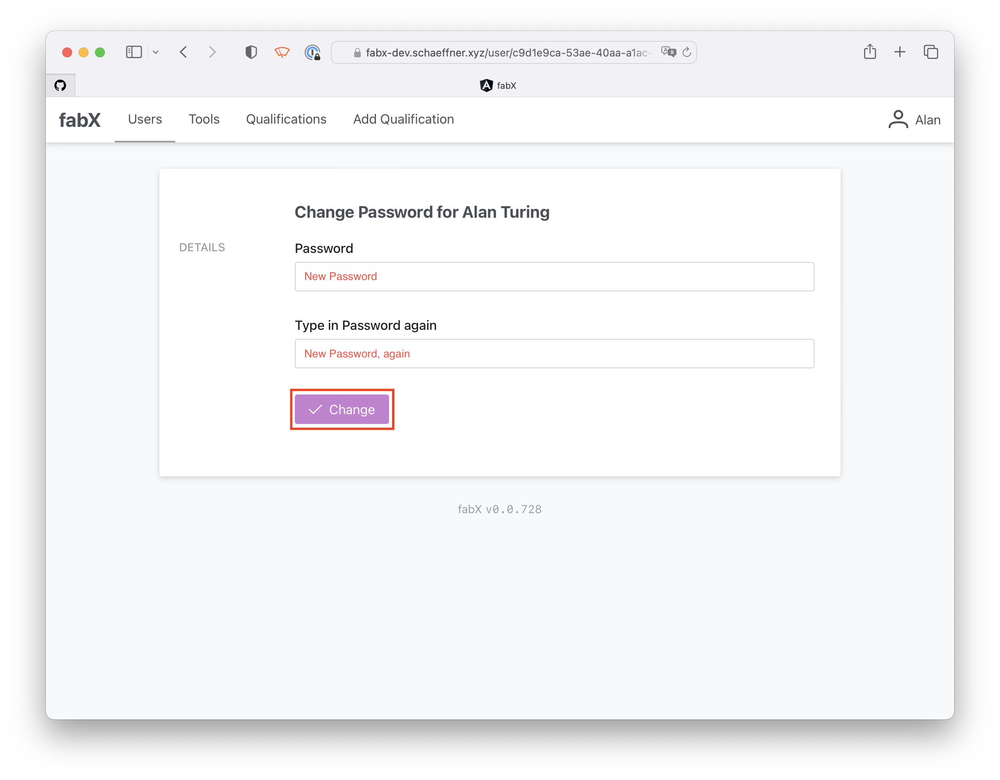
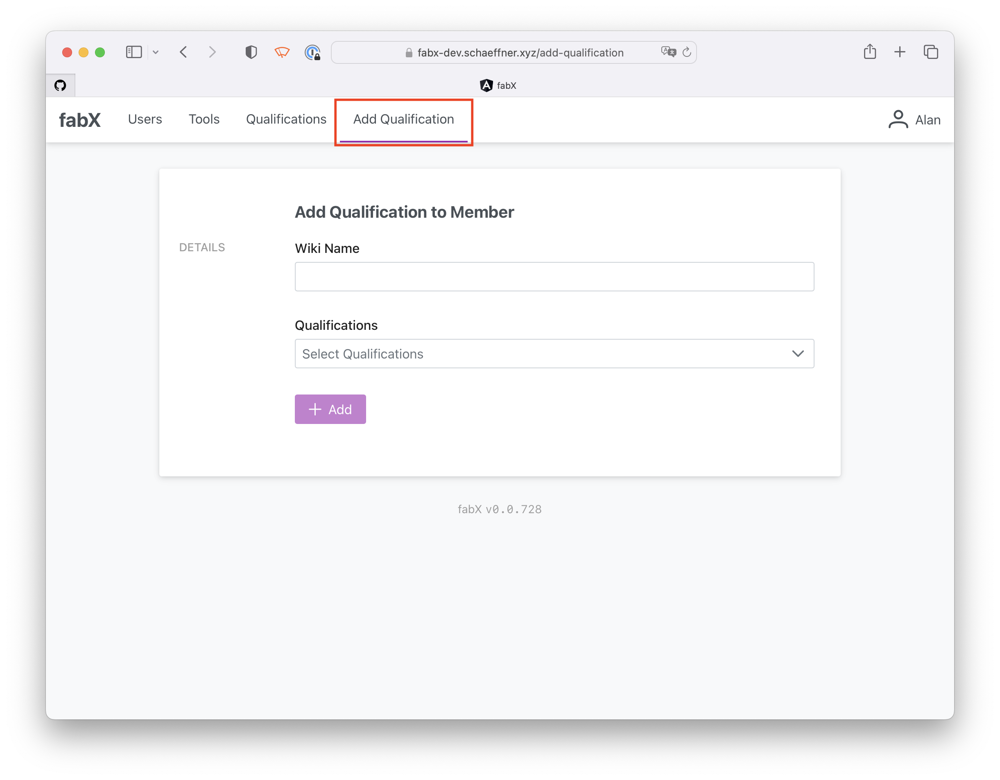
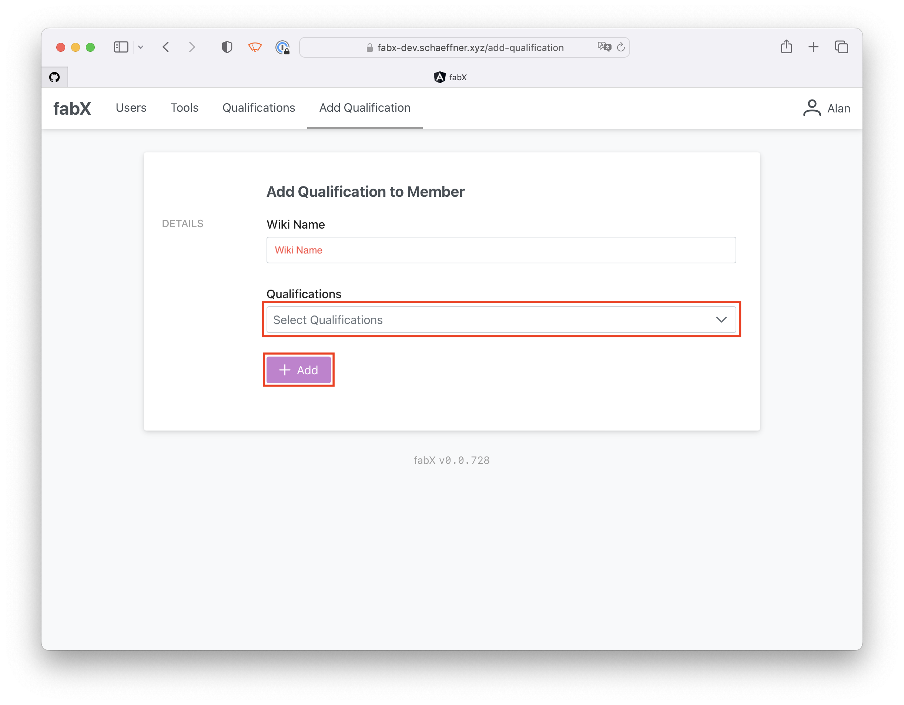

# Instructor Documentation

The following details the typical steps an Instructor works with.

## First Login

Your Administrator will add an account with a username and password for you.
With these login details, you can log in:

### Optional: Add Webauthn login

Once you're logged in, you can click on your own entry in the user list to go to its details page.

In the identities section, you can click _Add Webauthn_ to add a [Webauthn](https://en.wikipedia.org/wiki/WebAuthn) credential.
This can be of the form of a [passkey](https://fidoalliance.org/passkeys/).

### Change Password

During your first login, please change your password.

First, click on your username at the top right:

A drop-down menu will appear. Within that, select _Change Password_:

On the Change Password page, enter your new password twice.
Click on _Change_ to change your password.

## Add Qualification to Member

Once you have instructed a member (e.g., how to use a certain tool), you can hand out the according qualification to the member.
For this, click _Add Qualification_ in the navigation bar at the top.

On the Add Qualification to Member page, first, enter the member's wiki name (i.e., their Confluence username).
Next, select the Qualification you want to hand out to them.
Only Qualifications you are Instructor for can be selected.
Click _Add_ to hand out the Qualification to the Member.

### Remove Qualification from Member

Only Administrators can remove a Qualification from a Member.
Contact an Administrator.